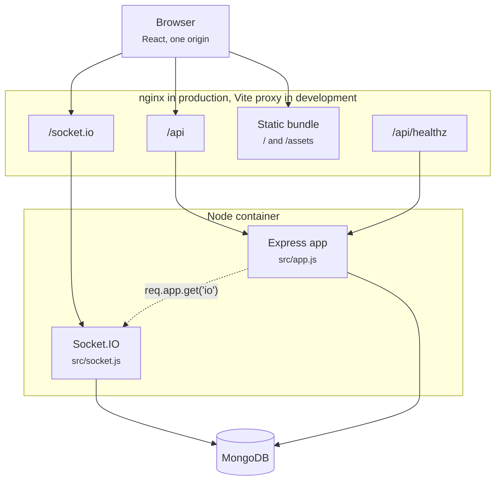
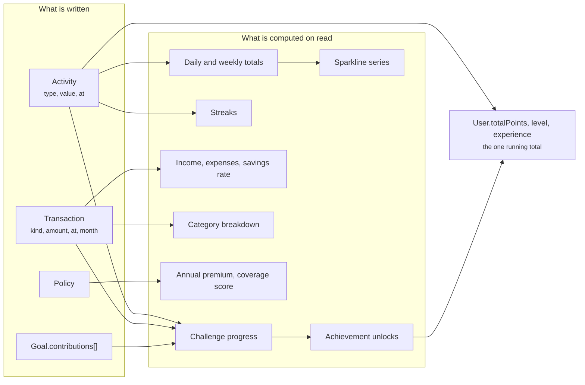
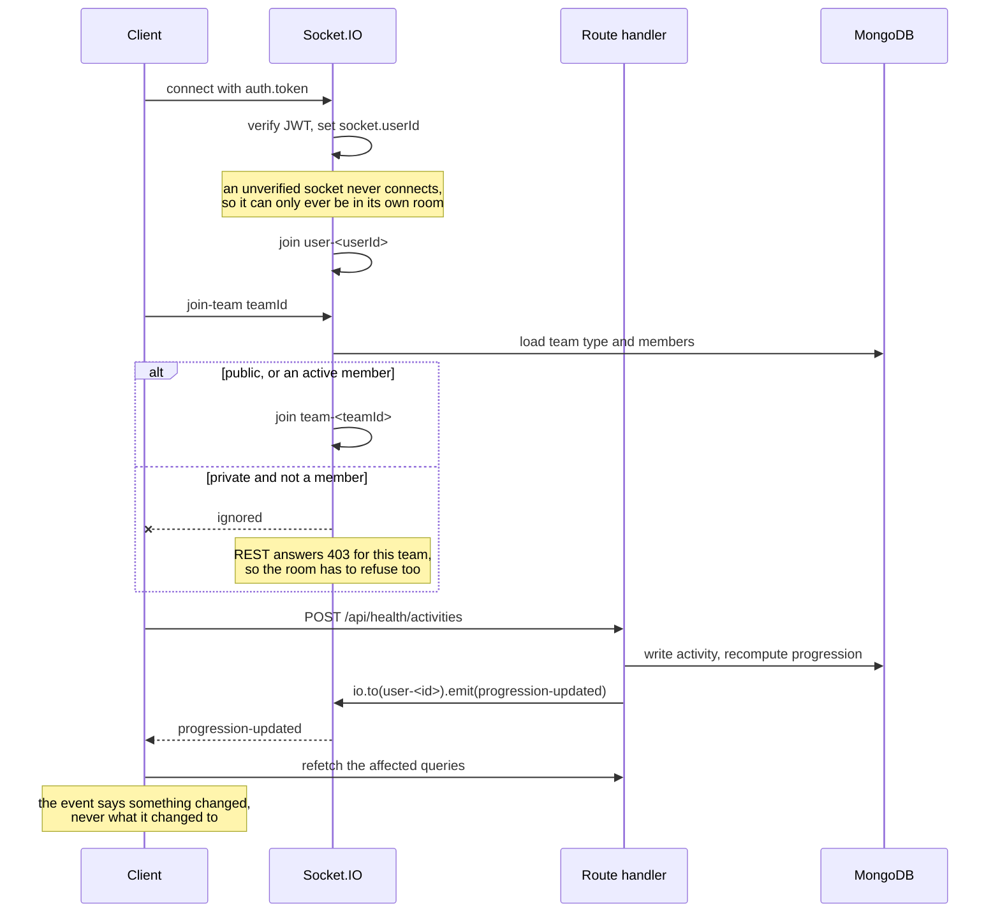

# WellnessHub - Developer Documentation

Technical reference for the WellnessHub codebase: architecture, auth model, data model, API
surface, and setup/deployment. For what the app does from a user's point of view, see
[README.md](./README.md).

## Table of contents

- [Tech stack](#tech-stack)
- [Repository layout](#repository-layout)
- [Architecture overview](#architecture-overview)
- [Auth model](#auth-model)
- [Data model](#data-model)
- [Derived figures](#derived-figures)
- [Progression](#progression)
- [Realtime](#realtime)
- [API surface](#api-surface)
- [Frontend structure](#frontend-structure)
- [Design system](#design-system)
- [Keyboard model](#keyboard-model)
- [Environment variables](#environment-variables)
- [Local setup](#local-setup)
- [Docker](#docker)
- [Testing](#testing)
- [Continuous integration](#continuous-integration)
- [Conventions and traps](#conventions-and-traps)
- [Known gaps](#known-gaps)

## Tech stack

**Client:** React 19, TypeScript 5, Vite 7, Tailwind CSS 3, TanStack Query 5, React Router 7,
Vitest. There is no chart library - the sparklines are hand-rolled SVG in
`components/Sparkline.tsx`, which is a fraction of the weight and matches the table rows
exactly.

**Server:** Node 20, Express 5, Mongoose 8, MongoDB 7, Socket.IO 4, `express-validator`,
`swagger-jsdoc`, Jest with `mongodb-memory-server`.

## Repository layout

```
.
├── client/                  React console (Vite)
├── server/                  Express API
├── docker-compose.yml       mongodb + backend + frontend
├── deploy.sh                Build and run the full stack in Docker
├── start.sh                 Run API and client locally with reload
└── .env                     Shared by both, gitignored
```

Both halves read the same root `.env`. The server loads `server/.env` first if it exists, then
falls back to the root file; real process environment always wins over both.

## Architecture overview



Rooms are `user-<id>`, `challenge-<id>` and `team-<id>`. A socket joins its own user room from
the verified token and never from client input; the other two are requested by the client and
checked before the join (see **Realtime**).

The static bundle and the API share one origin, so the browser never makes a cross-origin
request. `/api/healthz` is the API's liveness probe and is proxied deliberately: the API's own
endpoint is at `/health`, which is also a client route, so proxying that path would have taken
the Health page away from users to give a probe a shorter URL.

The client never talks to the API cross-origin. In development the Vite proxy forwards `/api`
and `/socket.io` to `localhost:5000`; in production the frontend's nginx does the same to the
`backend` container. That is why `VITE_API_URL` defaults to `/api`, and why the `CORS_ORIGIN`
allowlist only matters for non-browser or alternative-host deployments.

Three files own three separate concerns:

| File | Owns | Deliberately does not |
|---|---|---|
| `server/src/app.js` | Builds and returns the Express app | Listen, connect to Mongo, install process handlers |
| `server/src/socket.js` | Socket.IO server and its rooms | Anything HTTP |
| `server/server.js` | DB connect, listen, signals, graceful shutdown | Define routes |

`app.js` is side-effect free, which is what lets the tests mount it against an in-memory
MongoDB without opening a port.

## Auth model

Registration and login return a JWT signed with `JWT_SECRET`, expiring after `JWT_EXPIRE`
(default 7 days). The client stores it in `localStorage` under `wellness_token` and sends it as
`Authorization: Bearer <token>`.

`protect` (in `src/middleware/auth.js`) verifies the token, loads the user, rejects deactivated
accounts, and sets `req.user`. `authorize(...roles)` layers role checks for admin routes and
reads the top-level `role` field on User.

On the client, `ApiService` watches for any `401`, clears the stored token, and notifies
subscribers; `AuthContext` subscribes and drops the session. That stops an expired token from
leaving the UI signed in with every request failing.

Passwords are hashed by a `pre('save')` hook on the User schema, so no route calls bcrypt and no
new code path can write a plain-text password.

Two rate limiters: a global one over `/api` keyed by IP, and `rateLimitByUser(max, windowMs)` on
expensive routes keyed by user id. `/health` sits above the limiter so a busy API cannot look
dead to an orchestrator.

`rateLimitByUser` keeps its counters in a closure `Map`. An entry is only revisited when that
same user comes back, so it sweeps the whole map once per window: without that, one entry per
user who ever touched the route stayed for the life of the process, and some of those windows
are 24 hours long.

`optionalAuth` sits beside `protect` for routes that are readable anonymously but show more to a
signed-in viewer. `GET /api/users/:id` is the only one today. It matters that such a route uses
it rather than nothing at all: `req.user` is otherwise always `undefined` there, so a branch
testing it never runs and reads as working code.

## Data model

Eight collections in `server/src/models/`. Mongo creates them and their indexes from these
schemas on boot - there is no init script.

### Activity

The source of truth for the health module. One document per logged event.

| Field | Notes |
|---|---|
| `user`, `type`, `value`, `unit` | `type` is constrained to the keys of `models/metrics.js` |
| `at` | When it **happened**, not when it was logged, so backfilling counts towards the right day |
| `day` | Denormalised `YYYY-MM-DD` of `at`, used as the grouping key |
| `pointsEarned` | Snapshotted at write time from `pointsFor(type, value)` |

Indexed on `{user, at}`, `{user, type, at}` and `{user, day}` - the three shapes every query
takes.

### metrics.js

Not a collection: the single table defining every tracked metric (unit, how same-day entries
combine, whether the goal is daily or weekly, which User field holds the goal, precision, and
the points function). Routes, aggregation and the client's table columns all read from it, so
adding a metric is a one-file change. The client fetches the public half from
`GET /api/health/metrics`.

### Transaction

`kind` (income/expense), `amount` (always positive - `kind` carries the direction), `category`,
`at`, and a denormalised `month`. Categories are validated per kind, so an income category on an
expense is rejected. Static helpers provide the monthly and per-category aggregations.

### Policy

`type`, `provider`, `coverageAmount`, `premium`, `premiumFrequency`, `renewalDate`, `status`.
Two virtuals: `annualPremium` normalises the billing cycle so policies are comparable, and
`daysUntilRenewal` goes negative once lapsed.

### Goal

`domain` (health/wealth), `title`, `targetValue`, and a `contributions[]` array. `currentValue`
and `progress` are **virtuals summing the contributions**, never stored, so deleting a
contribution corrects the goal. A `pre('save')` hook flips `status` to `achieved` at 100%.

### User

Identity, progression (`level`, `experience`, `totalPoints`, `availablePoints`, streaks),
`healthMetrics` (goal targets only - the readings live in Activity), `financialMetrics`
(standing figures only - movements live in Transaction), social lists, team and challenge
membership, preferences, and `role`.

`activities[]` on User is the **social feed** (milestones the user chose to share), which is a
different thing from the Activity collection (the private health log). Do not merge them.

Two `pre('save')` hooks matter: one hashes the password, the other recomputes `level` from
`experience` as `floor(experience / 1000) + 1`, so level is derived and never set by a route.

### Achievement, Challenge, Team

Unchanged from the original design: an achievement catalogue with rarity and an availability
window, challenges with targets and participant stats, and teams with members and rankings.

All timestamps are stored as UTC `Date` and formatted in the client's locale at render time.

## Derived figures

Nothing that can be recomputed is stored as a counter. This is the central design decision and
the reason the app stays self-consistent.

| Figure | Derived from | Where |
|---|---|---|
| Daily/weekly metric totals | `Activity` grouped by `day` | `services/health.js` |
| Sparkline series | Same, zero-filled to one point per day | `services/health.js` |
| Streaks | The set of distinct days with any activity | `services/streaks.js` |
| Income, expenses, savings rate | `Transaction` grouped by month | `models/Transaction.js` |
| Category breakdown | `Transaction` grouped by category | `models/Transaction.js` |
| Goal progress | Sum of `contributions[]` | `models/Goal.js` virtual |
| Annual premium | `premium × frequency multiplier` | `models/Policy.js` virtual |
| Coverage score, gaps | The set of active policy types | `routes/insurance.js` |
| Level | `floor(experience / 1000) + 1` | `models/User.js` hook |
| Challenge progress | `Activity`/`Transaction` inside the challenge window | `services/challenges.js` |
| Achievement unlocks | The catalogue evaluated against measured facts | `services/achievements.js` |

Two subtleties worth knowing:

- **Aggregation differs per metric.** `sum` for quantities, `last` for readings. Weight uses
  `last` and carries forward across unmeasured days, both in the current figure and in the
  sparkline - zero-filling it would draw a sawtooth that never happened.
- **The current streak tolerates an unlogged today.** It counts back from today if today has
  activity, otherwise from yesterday, so a streak only breaks after a full day passes.



`User.totalPoints`, `level` and `experience` are the single exception: they are written, not
derived, because they are a score. Everything else is recomputed, which is why correcting one
entry corrects every figure that depends on it with no recalculation step.

Two windows are deliberately not the dashboard's `period`:

- The **monthly wealth series** spans six months whatever the period. Scoped to the period it
  held one bucket at 7d and 30d, and the Overview draws its net-position sparkline only with
  more than one point, so that chart could never appear on the default view.
- **Nothing may be dated ahead of now.** The activity log has always refused it; transactions
  did not, so one entry dated next year landed in a future month bucket and pulled the savings
  rate and the prior-month averages with it. Both routes refuse it now, and the seed clamps to
  the same cutoff rather than generating days that have not happened.

## Progression

Logging one activity can advance a challenge, unlock an achievement and extend a streak at
once. Rather than have each route remember that, every write that could affect progression
calls `services/progression.js#recompute(user, { io })`, which fans out in a fixed order:

1. **Challenges** - `services/challenges.js` measures each joined, unfinished challenge and
   writes the result back, awarding its points the first time it completes.
2. **Achievements** - `services/achievements.js` evaluates the catalogue. It runs *after*
   challenges, so completing one can immediately satisfy a "complete your first challenge"
   criterion in the same request.
3. **Streaks** - recomputed from the activity log and mirrored onto the user.
4. **Socket push** - `progression-updated`, plus `challenge-completed` and
   `achievement-unlocked` per event, to the user's own room.

Two properties matter. `recompute` is **idempotent**: an achievement already unlocked is
skipped and a completed challenge is not re-awarded, so re-running never double-pays. And it
**never fails the request**: progression is a side effect of the user's actual write, so an
error there is logged and the write still stands.

Challenge measurement resolves the target's `unit` to a source of truth (the Activity log for
health units, Transaction/Goal for money) and measures inside a window that starts at the later
of the challenge start and the **start of the day** the user joined - so joining at 6pm still
counts that morning's steps, but never days before they signed up. A `frequency` target counts
qualifying *days* rather than summing a value: "10,000 steps every day for a week" is seven
daily wins, not 70,000 steps.

## Realtime

`services/progression.js` emits to the joining user's room; `client/src/hooks/useLiveUpdates.ts`
subscribes. The socket carries **notifications, not state**: on an event the client invalidates
the affected queries and refetches, so the API stays the single source of truth rather than the
cache being patched from a payload that could drift.

One catch worth remembering: points, level and streak in the header come from `AuthContext.user`,
not from a query, so a progression event calls `refreshUser()` as well as invalidating the
cache. Invalidation alone leaves the header stale.



Two rules hold this together, and both were once broken:

- **A room join is an authorisation decision.** `join-team` checked nothing, so a user the REST
  route would refuse with a 403 could still sit in a private team's room and watch it.
- **`friend-activity` goes to friends.** It was a `socket.broadcast.emit`, which is every
  connected socket. It now fans out to the sender's friends and followers, the same audience
  `POST /api/community/share` uses.

## API surface

All responses use `{ success, message?, data }`. Paths are relative to `/api`. "Auth" means a
bearer token is required.

| Method | Path | Auth | Returns |
|---|---|---|---|
| POST | `/auth/register`, `/auth/login` | - | `{ token, user }` |
| GET | `/auth/me` | yes | `{ user }`, relations populated |
| POST | `/auth/logout`, `/auth/forgot-password`, `/auth/reset-password` | - | Acknowledgement |
| POST | `/auth/change-password` | yes | Password replaced |
| GET/PUT | `/users/profile` | yes | `{ user }` |
| GET | `/users/stats`, `/users/leaderboard`, `/users/search` | mixed | Progression figures, rankings |
| GET | `/health/metrics` | - | Metric definitions the client renders columns from |
| GET | `/health/summary?days=` | yes | Per-metric current value, goal, progress, series, streaks |
| GET/POST | `/health/activities` | yes | List, or log one and award points |
| DELETE | `/health/activities/:id` | yes | Deletes, scoped to the owner |
| PUT | `/health/goals` | yes | Updated goal targets |
| GET | `/wealth/categories` | - | Valid categories per kind |
| GET | `/wealth/summary?months=` | yes | Income, expenses, net, savings rate, series, categories |
| GET/POST | `/wealth/transactions` | yes | List or record |
| DELETE | `/wealth/transactions/:id` | yes | Deletes, scoped to the owner |
| GET/POST | `/wealth/goals` | yes | Goals with derived progress |
| POST | `/wealth/goals/:id/contributions` | yes | Adds progress |
| PUT | `/wealth/profile` | yes | Standing financial figures |
| GET | `/insurance/types` | - | Valid policy types |
| GET/POST | `/insurance/policies` | yes | Policies plus coverage and premium totals |
| PUT/DELETE | `/insurance/policies/:id` | yes | Update or remove, scoped to the owner |
| GET | `/insurance/alerts?withinDays=` | yes | Renewals, overdue policies, coverage gaps |
| GET | `/insurance/coverage` | yes | Score, essentials held/missing, premium-to-income |
| GET | `/challenges` | - | Filterable by category, type, difficulty |
| GET | `/challenges/mine` | yes | Joined challenges with measured progress |
| POST | `/challenges/:id/join`, `/:id/progress` | yes | Join or record progress |
| GET/POST | `/community/teams`, `/teams/:id/join` | mixed | List, create or join a team |
| GET | `/community/feed` | yes | Shared activities from people you follow |
| POST | `/community/share` | yes | Push a milestone to your feed |
| GET | `/community/leaderboard` | - | `{ type, period, leaderboard[] }` |
| GET | `/gamification/achievements`, `/progress` | mixed | Catalogue, and level/points/streak |
| POST | `/gamification/daily-bonus`, `/spend-points` | yes | Claim or spend |
| GET | `/analytics/dashboard?period=` | yes | Cross-module figures for the overview |
| GET | `/analytics/trends?period=` | yes | Daily points and per-metric series |
| GET | `/analytics/admin/overview` | admin | Platform counts |

Outside `/api`: `GET /health` is the API's liveness probe (reached through the stack as
`/api/healthz`, because `/health` is also a client route), `/api-docs` serves Swagger UI, and
`/api-docs.json` the raw OpenAPI document.

`client/src/services/api.ts` is the only module that knows these paths.

## Frontend structure

```
client/src/
├── main.tsx            Entry point
├── App.tsx             Providers, router, global keyboard shortcuts
├── index.css           Design tokens and component classes
├── components/
│   ├── Shell.tsx           Top bar, nav, the NAV table shortcuts read
│   ├── CommandPalette.tsx  ⌘K palette
│   ├── Panel.tsx           Bordered region + PanelState (loading/error/empty)
│   ├── Stat.tsx            Figure in a header strip, and StatRow
│   ├── Sparkline.tsx       Inline SVG sparkline
│   ├── AuthScreen.tsx      Sign in / create account
│   └── ErrorBoundary.tsx   Stops one bad render blanking the app
├── contexts/           AuthContext, ThemeContext
├── hooks/useApi.ts     One query/mutation hook per endpoint
├── lib/format.ts       Formatting, and pick/pickArray for untyped payloads
├── pages/              One per route
├── services/api.ts     The only module that knows API paths
└── types/              Shared domain types
```

`AppShell` in `App.tsx` is the layout route: spinner while auth resolves, `AuthScreen` when
signed out, the shell with an `<Outlet/>` otherwise. Everything except the overview is
`React.lazy`.

Writes go through one `useWrite` helper in `hooks/useApi.ts` that owns the toast and the cache
invalidation. Invalidation is by key **prefix** - `['health']` refreshes every health query - so
the per-module scope arrays (`HEALTH_SCOPE`, `WEALTH_SCOPE`, `INSURANCE_SCOPE`) are the single
place that decides what a write refreshes.

API payloads are loosely typed, so pages read them through `pick(source, 'a.b.c', fallback)` and
`pickArray(source, 'a.b')` from `lib/format.ts`. `pick` preserves `0` and `false`; `pickArray`
guarantees an array so a payload shape change degrades to an empty state instead of blanking the
page.

## Design system

The look is a console, not a dashboard. The rules that keep it that way, all in `index.css`:

- **Hairline rules, not cards.** One container (`.panel`), 3px radius, no shadows, no gradients.
- **Tabular numerals everywhere a figure appears** (`.tnum`, `.mono`), so columns align down the
  page and digits do not jitter as values change.
- **13px base, 10px uppercase micro-labels, 28px rows.** Density is the point.
- **One accent colour**, used only for interaction and the primary series. Red, amber and green
  are reserved for semantics (over/under goal, income/expense, alert severity).
- **Meters are a 3px rule**, not a rounded pill.

Every colour is a CSS variable on `:root` with a `.dark` override, and `tailwind.config.js`
maps its palette onto those variables. Light and dark are one palette with two value sets, not
two designs.

The ADK DEV mark lives at `client/src/assets/logo-mark.png` (and `public/` for the favicon). It
is solid purple on transparent, so `.logo-mono` applies `brightness(0)` in light mode and
`brightness(0) invert(1)` in dark. One file, both themes - do not add a recoloured copy.

## Keyboard model

Handled in `AppShell` in `App.tsx`:

| Keys | Does |
|---|---|
| `⌘K` / `Ctrl+K` | Toggle the command palette, even from inside a field |
| `g` then `o h w i c m a` | Jump to Overview, Health, Wealth, Insurance, Challenges, Community, Analytics |
| `t` | Cycle theme light -> dark -> system |
| `up` `down` `enter` `esc` | Move, run and close inside the palette |

Single-key shortcuts are suppressed while an input, textarea or select has focus. The `g` chord
listens for one following key and abandons after a second. Section keys live on the `NAV` table
in `Shell.tsx`, so adding a route adds its shortcut.

## Environment variables

All in the root `.env`; copy `.env.example`. `.env` is gitignored.

### Server only - must never reach the client bundle

| Variable | Required | Purpose |
|---|---|---|
| `MONGODB_URI` | yes | Connection string |
| `JWT_SECRET` | yes | Signs and verifies JWTs |
| `JWT_EXPIRE` | no | Token lifetime, default `7d` |
| `NODE_ENV`, `PORT` | no | Defaults `development`, `5000` |
| `CORS_ORIGIN` | no | Comma-separated allowed browser origins |
| `RATE_LIMIT_WINDOW`, `RATE_LIMIT_MAX` | no | Minutes, and requests per window |
| `LOG_LEVEL`, `LOG_DIR` | no | `error`/`warn`/`info`/`debug`, and where logs are written |

`src/config/env.js` validates these at import time: a missing `MONGODB_URI` or `JWT_SECRET`
throws immediately rather than failing on the first request, and in production the server
refuses to start if `JWT_SECRET` is still the example value.

Nothing else in the server reads `process.env` directly. Add new variables to `env.js`.

### Build-time, inlined into the client bundle

| Variable | Purpose |
|---|---|
| `VITE_API_URL` | API base, default `/api`. Only public values belong in a `VITE_` variable - Vite bakes them into the shipped JavaScript. |
| `VITE_DEV_API_PROXY` | Where the dev server proxies `/api`, default `http://localhost:5000` |

### docker-compose only

`MONGO_ROOT_USERNAME`, `MONGO_ROOT_PASSWORD`, `MONGO_DB_NAME`, `MONGO_PORT`, `FRONTEND_PORT`.

## Local setup

Requires Node 20+ and MongoDB.

```bash
cp .env.example .env      # set JWT_SECRET and MONGODB_URI
./start.sh                # installs if needed, runs both halves
cd server && npm run seed # 90 days of sample history
```

The seed is **destructive** - it clears the collections it seeds. It generates day-by-day
activity with a weekly rhythm and rest days, six months of transactions with recurring bills,
policies with a near-term renewal so the alerts have something to show, and derives each user's
points and streaks from the activities it just inserted. It uses a deterministic PRNG, so
re-seeding produces the same data.

| Location | Command | Does |
|---|---|---|
| server | `npm run dev` | Nodemon with reload |
| server | `npm test` | Jest against an in-memory MongoDB |
| server | `npm run lint` | ESLint 9 flat config |
| server | `npm run seed` | Seeds sample data |
| client | `npm run dev` | Vite dev server with `/api` proxy |
| client | `npm run build` | Typecheck then production build |
| client | `npm test` | Vitest |

## Docker

```bash
cp .env.example .env      # JWT_SECRET and MONGO_ROOT_PASSWORD are mandatory
./deploy.sh               # build and start
./deploy.sh --no-cache    # rebuild from scratch
./deploy.sh --clean       # remove containers, images and volumes first
```

Three services: `mongodb`, `backend`, `frontend`. Each waits on the one below it being
**healthy**, not merely started, so nginx never begins proxying to an API that has not finished
connecting to Mongo. `frontend` is nginx serving the built client and proxying `/api` and
`/socket.io` to `backend`, which is why the browser only ever sees one origin. Both images run
as non-root; the server installs with `npm ci --omit=dev` and probes health with `node` rather
than adding `curl`.

Healthchecks address `127.0.0.1`, never `localhost`. In these images `localhost` resolves to
`::1` first while both servers listen on IPv4 only, so a probe on the name is refused and the
container reports unhealthy while serving every request normally. A CI job asserts all three
report healthy, because nothing else notices.

The compose file maps Mongo's port to the host so a local `npm run dev` can share the database.
Remove that mapping when deploying.

## Testing

Server tests use Jest with `mongodb-memory-server`, driving the real Express app through
`supertest`. `tests/setup.js` starts one in-memory MongoDB and clears every collection after
each test, so ordering never matters. `tests/helpers.js` provides `registerUser()`.

Coverage is aimed at the derived figures and the ownership boundaries, because those are where
the bugs were:

- **auth** - registration validation, password hashing, login, token verification, and a
  regression test for `/auth/me` with populated relations
- **health** - per-metric aggregation (sum vs last reading), goal progress, future-date
  rejection, series density, and cross-user delete protection
- **wealth** - savings rate, category breakdown, per-kind category validation, goal progress
  from contributions, auto-achievement
- **insurance** - premium annualisation across all four billing cycles, renewal and overdue
  alerts, coverage gaps, scoring
- **streaks** - the derivation itself, including the unlogged-today tolerance
- **progression** - challenge measurement (count and frequency targets), completion awarding
  once and only once, and achievement unlocking with its idempotence and availability window
- **users-routes** - the two endpoints that answered 404 for every caller, and the search term
  that was handed to the regex engine verbatim
- **socket** - handshake rejection, the team-room authorisation check, and who a
  `friend-activity` event actually reaches
- **rate-limit-by-user** - the limit itself, and the sweep that stops the counter map growing
  for the life of the process
- **analytics-series** - the monthly wealth series, which was scoped to the dashboard period and
  so held one bucket on the default window
- **wealth-future** - a transaction dated ahead of now, which the activity log has always
  refused and this route did not

Client tests cover `lib/` and `services/api.ts`, plus `Sparkline` (its scaling, including the
flat series that used to be drawn along the floor), `ErrorBoundary` and `ThemeContext`.

```bash
cd server && npm test        # 122 tests
cd client && npm test        # 52 tests
cd server && npm run test:ci # with the coverage floor
cd client && npm run test:ci # with the coverage floor
```

Every test added during this pass was run against the unfixed code first and watched to fail.
A test written after the fix, never seen red, proves only that it runs.

## Continuous integration

`.github/workflows/ci.yml` runs on push, on pull request and on `workflow_dispatch`. There is no
schedule. Runs are cancelled when superseded by a newer push to the same branch.

| Job | What it proves |
|---|---|
| **server** (Node 20.19, 24) | Lint, then Jest with a coverage floor. The mongod binary is cached so CI does not re-download it every run |
| **client** (Node 20.19, 24) | Lint, typecheck, Vitest with a coverage floor, then a production build to catch what only fails under Rollup |
| **audit** (server, client) | `npm audit --audit-level=low` over the whole tree, dev included |
| **docker** | Both images build |
| **compose** | The stack comes up, and then the four assertions below |
| **hygiene** | Plain ASCII, no entity forms of the same characters, nothing tracked that should not be |
| **readme-images** | Every screenshot a README references exists |
| **readme-pair** | `README-light.md` regenerates with no diff |

Both matrices run the declared Node floor as well as current, because `engines.node` says
`>=20` and testing only one of them checks half the claim.

### Why the coverage floors are low, and what they are for

Server coverage sits near 57%, client near 16%. Neither number is a quality bar and neither is
presented as one: the pages and the data hooks have no tests at all, which the **Known gaps**
section states plainly.

The floors exist for the one thing a floor is uniquely good at. **Jest exits 0 when it collects
no tests, and so does Vitest.** A suite that silently stopped running reports as a pass
everywhere else in the pipeline; a coverage figure of zero against a floor does not. Each floor
is set just under the current number, so it catches collapse rather than drift.

### What the compose job checks that nothing else can

Unit tests run against an in-memory MongoDB and the docker job only builds images. Neither would
notice the deployed stack being wrong, and three real faults lived exactly there:

- **Security headers reach the pages that need them.** nginx discards inherited `add_header`
  directives in any location that declares one of its own. All three locations serving this
  image's content set `Cache-Control` or `Content-Type`, so the server-level `X-Frame-Options`,
  `X-Content-Type-Options` and `Referrer-Policy` reached none of them. `always` does not help;
  it only governs error responses. The config read correctly the whole time.
- **The proxied API keeps exactly one set of its own.** helmet sets these on the API, and a
  second copy from nginx put two conflicting `X-Frame-Options` values on one response.
- **`/api/healthz` reports the API, not the SPA shell.** Unproxied it fell through to the SPA
  fallback and answered 200 with `index.html` whether or not the API was running.
- **Every container reports healthy.** The frontend's healthcheck fetched `http://localhost/`,
  which resolves to `::1` first while nginx listens on IPv4 only. The container served every
  request normally and reported unhealthy for its entire life, which would have stalled anything
  gating on it.

### What CI still does not cover

**The automated tests do not exercise the UI.** Every page was walked manually in Chrome against
a seeded database, which is what caught the payload-shape mismatches, the future-dated seed
rows and the wealth series that could never draw. Repeat that after changing a page:
`npm run seed`, sign in as `john@example.com / Password123!`, visit every route.

## Conventions and traps

Things that have already caused bugs here:

- **Model virtuals must survive a projection.** Every schema sets `toJSON: { virtuals: true }`,
  so virtuals run whenever a document is serialised - including one loaded by a `populate()`
  that omitted the fields the virtual reads. Guard them (`(this.members || [])`,
  `this.stats?.totalPoints`). An unguarded virtual throws inside `res.json()`, far from its
  cause: this once made `/auth/me` fail for every user in a team, reported as `401 Invalid token`.
- **Do not wrap a whole handler in a `catch` that returns 401.** That is what disguised the
  above. Let `protect` own token errors and let real errors reach the error handler.
- **Check field names against the schema.** `user.following` (schema: `followedUsers`),
  `user.streakCount` (schema: `currentStreak`) and a `weeklyPoints` sort field all silently
  produced wrong output rather than errors, because Mongo returns `undefined` instead of failing.
- **Do not declare an index twice.** `email`, `username` and Team `name` get theirs from
  `unique: true`; adding a matching `schema.index()` makes Mongoose warn on every boot.
- **Express 5 leaves `req.body` undefined** on a body-less request. `app.js` normalises it to
  `{}` once, because several routes take an entirely optional body.
- **Read lists with `pickArray`.** A payload that changes shape then degrades to an empty state
  rather than throwing `.map is not a function` and blanking the page.
- **`Challenge.status` defaults to `draft`** and the list route only returns `active`. New
  fixtures must set it explicitly.
- **Declare static routes before parameterised ones.** Express matches in order, so
  `/challenges/trending`, `/featured` and `/mine` must sit above `/challenges/:id` or they are
  swallowed and rejected as an invalid id. This trap was written down and the same bug was
  still in `users.js`: `GET /friends` sat below `GET /:id`, so every call to it was matched as
  `id = "friends"`, cast-failed, and answered `404 Resource not found`. Nothing caught it
  because no test and no page called that endpoint.
- **A guard must read a field the projection kept.** `GET /api/users/:id` selected a field list
  that omitted `isActive` and `preferences`, then tested both. Mongoose returns `undefined` for
  an unselected path rather than failing, so `!user.isActive` was always true and the endpoint
  answered 404 for every user alive, while the privacy checks below it could never match either.
  Reading a field is not enough; it has to be in the `select`.
- **Never interpolate user input into a `$regex`.** `/users/search` passed the term straight
  through, so `.*` matched every document and returned the whole user directory to a caller
  with no credentials. Escape the metacharacters and cap the page size.
- **When two paths remove or authorise the same thing, one of them knows less.** The event hub's
  error path deleted a subscriber without the cleanup its normal path did; `join-team` skipped
  the team-type check the REST route enforces. Route both through one function rather than
  copying the second half into the first.
- **Give the Sparkline room to shrink.** Its `width` is a drawing basis; `max-w-full` is what
  stops a 1200px chart forcing the whole page wider than a phone viewport.
- **Wrap form rows.** A row of fixed-width fields that cannot wrap stretches its panel, and the
  panel header with it, past the viewport on mobile.
- **A flat series has no range to scale against.** Falling back to a nominal range of 1 put
  every point at the minimum, which is the bottom of the box, so a steady 90kg read as though
  it had bottomed out. Mid-height is what "unchanged" looks like.
- **Do not name a keyboard modifier you have not detected.** The palette hint was hard-coded to
  the Mac symbol while the handler accepted either modifier, so it told every Linux and Windows
  user the wrong key. `lib/platform.ts` decides.
- **Browser storage is a convenience, never the source of truth.** It can throw outright in a
  private window and its contents can be evicted underneath a live tab. The theme cycle re-read
  it instead of using the state it already held, so a write that never landed sent the next step
  off from somewhere the user had already moved on from.

## Known gaps

- **No file uploads.** Avatars and policy documents are URL strings only. There is no upload
  route, and `multer`/`cloudinary` were removed because nothing imported them.
- **Period-scoped leaderboards are not supported.** The User schema keeps no per-period point
  buckets, so `/community/leaderboard` always ranks by `totalPoints` regardless of `period`.
  Deriving it from `Activity.pointsEarned` would fix this without new fields.
- **Team scoring is inert.** Teams can be listed, created and joined, but `stats.totalPoints`
  is never rolled up from members, so every team shows zero.
- **No password reset delivery.** `/auth/forgot-password` issues a token and returns it in
  development; nothing emails it.
- **No page has a test.** `lib/`, `services/api.ts`, `Sparkline`, `ErrorBoundary` and
  `ThemeContext` are covered; the eight pages and `hooks/useApi.ts` are not, which is most of
  the client by line count. Page behaviour is verified only by the manual browser pass.
- **The server's route coverage is thin.** `users.js`, `community.js` and `gamification.js` sit
  well under half. Two endpoints in `users.js` answered 404 for every caller and 82 passing
  tests said nothing, because neither route was ever called by a test or by the client.
- **`join-challenge` does not check membership.** Unlike `join-team` it lets any authenticated
  socket subscribe to a challenge room. That is consistent with REST, where any signed-in user
  may join any active challenge, so there is nothing there a member could not already read.
  Worth revisiting if private challenges are ever added.
- **The `/api/users/search` endpoint needs no credentials.** The term is escaped and the page
  size capped, so it can no longer return the whole directory, but an anonymous caller can
  still look a name up. That matches `/community/leaderboard`, which is also public, and both
  should probably be decided together.

---

The decisions behind these, including the ones that turned out wrong, are in
[not_for_you.md](./not_for_you.md).
