<!-- Generated from README.md by scripts/build-light-readme.mjs. Do not edit by hand. -->

<div align="center">

<picture>
  <source media="(prefers-color-scheme: dark)" srcset="./docs/assets/adk_dev_logo_light.png">
  
</picture>

# WellnessHub

**A keyboard-driven console for tracking health, money and insurance in one place, where looking
after them earns points, streaks and levels.**


[](https://github.com/Dileepadari/WellnessHub/actions/workflows/ci.yml)

**[Developer documentation](./DEVDOC.md)** &middot; [Getting started](#getting-started) &middot; [Features](#features)

<p><b>Light mode</b> &middot; <a href="./README.md">View this page in dark mode</a></p>

</div>


Most trackers cover one of the three and present it as a wall of cards. WellnessHub treats
them as one habit and shows them the way a trading terminal shows a portfolio: dense tables,
tabular figures, inline sparklines, everything on one screen.

## Screens

<table>
<tr>
<td width="33%" valign="top">
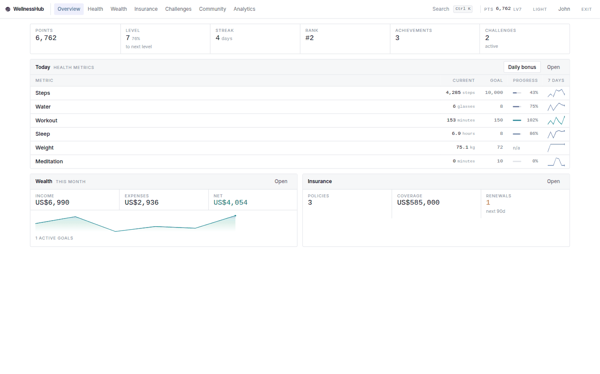
<p align="center"><b>Overview</b><br><sub>One panel per module, from a single dashboard call</sub></p>
</td>
<td width="33%" valign="top">
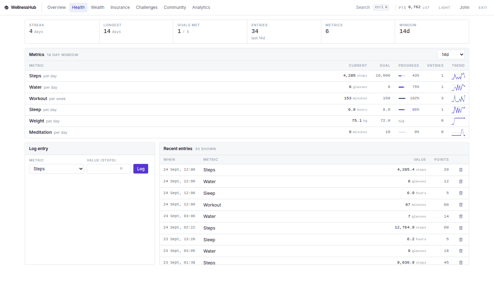
<p align="center"><b>Health</b><br><sub>Metrics against goals, with the log that produced them</sub></p>
</td>
<td width="33%" valign="top">
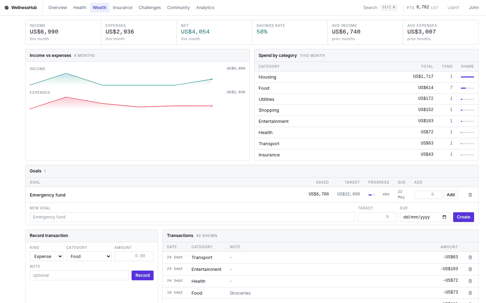
<p align="center"><b>Wealth</b><br><sub>Six months of income against expenses, and the ledger</sub></p>
</td>
</tr>
<tr>
<td width="33%" valign="top">
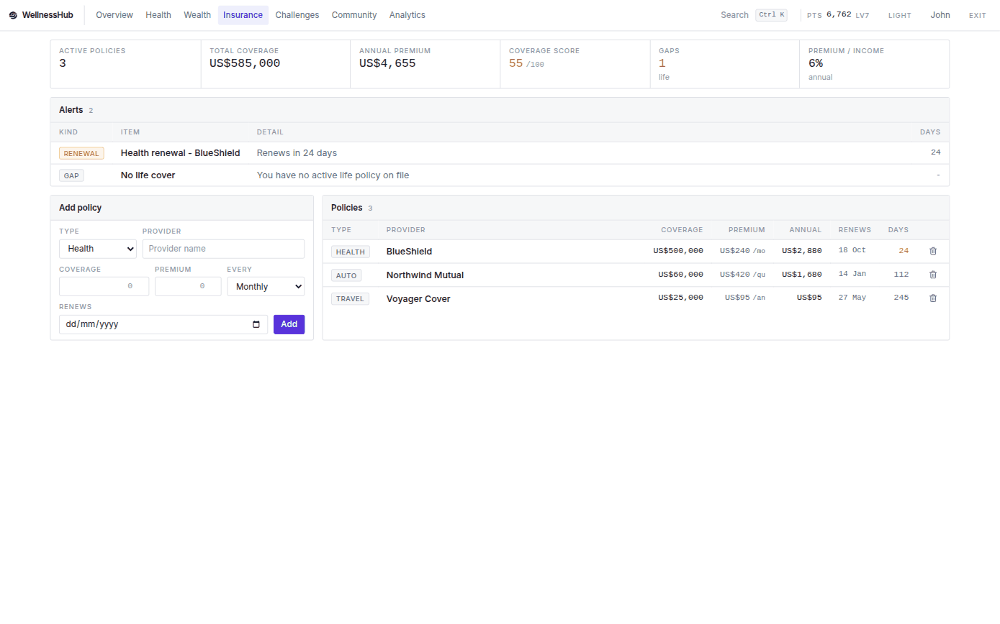
<p align="center"><b>Insurance</b><br><sub>Premiums annualised so policies are comparable</sub></p>
</td>
<td width="33%" valign="top">
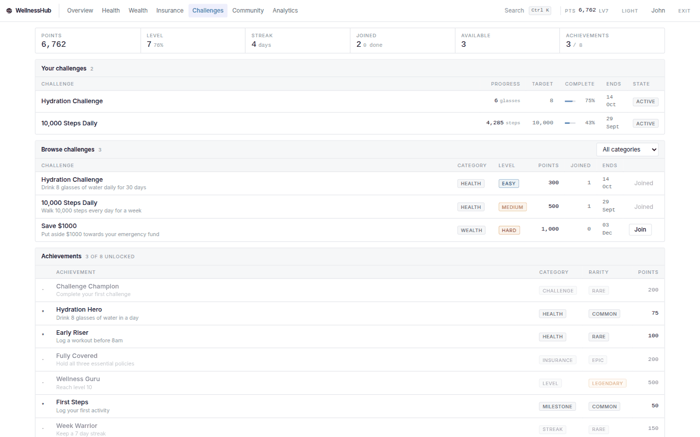
<p align="center"><b>Challenges</b><br><sub>Progress measured from the log, never self-reported</sub></p>
</td>
<td width="33%" valign="top">
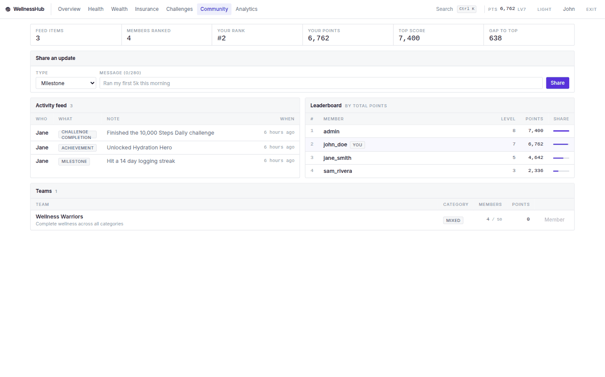
<p align="center"><b>Community</b><br><sub>Feed, leaderboard and teams</sub></p>
</td>
</tr>
<tr>
<td width="33%" valign="top">
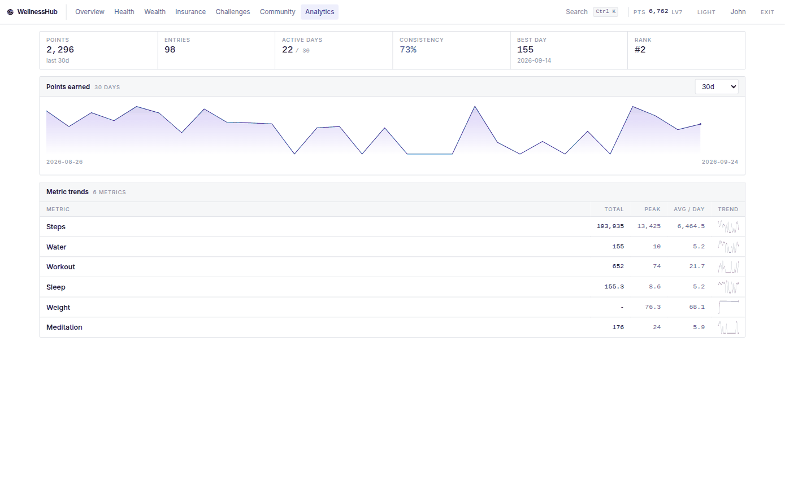
<p align="center"><b>Analytics</b><br><sub>Points, consistency and per-metric trends</sub></p>
</td>
<td width="33%" valign="top">
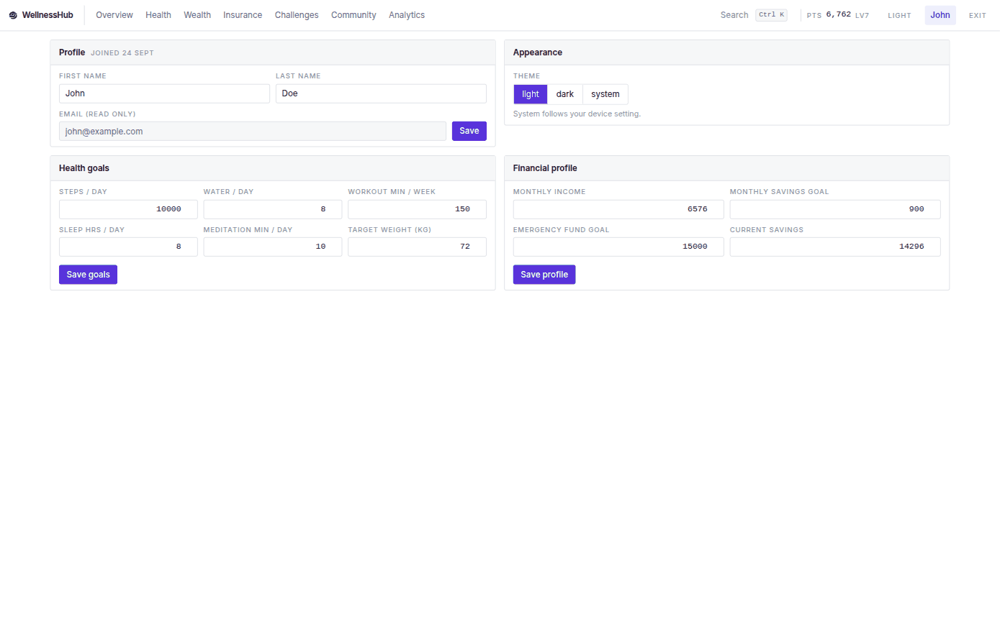
<p align="center"><b>Settings</b><br><sub>Goals live here: changing one rewrites every figure from it</sub></p>
</td>
<td width="33%" valign="top">
</td>
</tr>
</table>

<details>
<summary><b>On a phone and a tablet</b></summary>

<table>
<tr>
<td width="25%" valign="top">
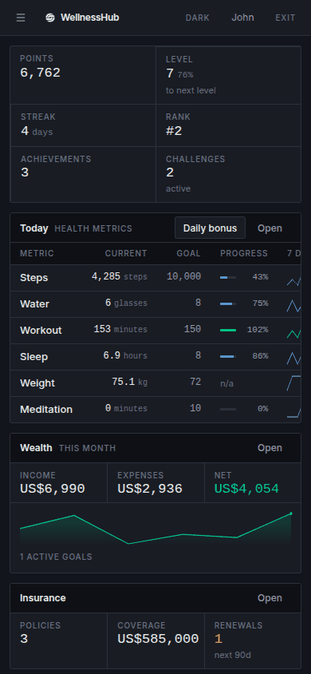
<p align="center"><b>Overview</b><br><sub>390px</sub></p>
</td>
<td width="25%" valign="top">
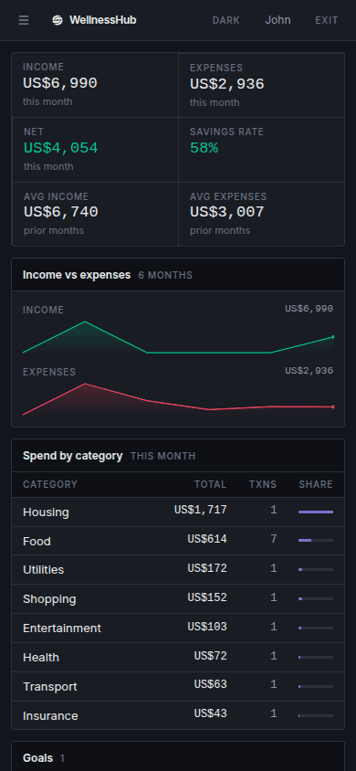
<p align="center"><b>Wealth</b><br><sub>390px</sub></p>
</td>
<td width="50%" valign="top">
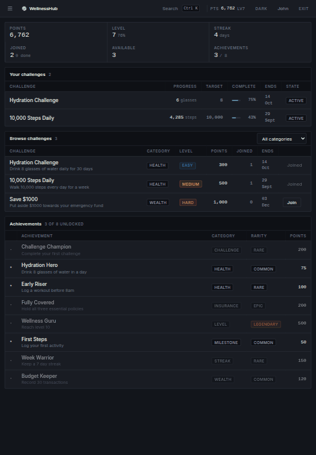
<p align="center"><b>Challenges</b><br><sub>820px</sub></p>
</td>
</tr>
</table>

Wide tables scroll inside their panel rather than widening the page, so there is no horizontal
page scroll at 390px.

</details>

## Features

### Health
- Log steps, water, workouts, sleep, weight and meditation, with the time they happened
- Every figure is aggregated from the log, so correcting or deleting an entry corrects the totals
- Daily and weekly goals per metric, with progress and a 7 to 90 day sparkline per row
- Streaks derived from the days you actually logged, tolerant of today not being logged yet
- Weight is treated as a reading, not a quantity: the latest value carries forward

### Wealth
- Record income and expenses against categories that differ by kind
- Monthly income, expenses, net and savings rate computed from the transactions
- Spend broken down by category with a share bar, and a 6 month income/expense trend
- Savings goals whose progress is the sum of their contributions, marked achieved automatically

### Insurance
- A policy register with coverage, premium, billing cycle and renewal date
- Premiums annualised so monthly, quarterly and annual policies are comparable
- Alerts for renewals due, policies already lapsed, and essential cover you do not hold
- A coverage score, and premium as a share of income

### Challenges and community
- Browse and join challenges by category and difficulty
- **Progress is measured, not self-reported**: a steps challenge advances as you log steps, and
  completes itself when you hit the target
- Achievements unlock from what you have actually done, and cascade - completing your first
  challenge unlocks the achievement for it in the same moment
- Teams you can browse and join, an activity feed, and a points leaderboard

### Throughout
- `Ctrl K` (or `Cmd K`) command palette for navigation and actions
- `g` then a section key to jump (`g h` for Health), `t` to cycle the theme
- Live updates: completing a challenge or unlocking an achievement appears without a refresh
- Light and dark from one palette, following your device by default
- Works down to a phone-width viewport, with wide tables scrolling inside their panel

## How points and levels work

Every logged activity is worth points, scaled to the metric: steps award 5 per thousand,
water 2 per glass, a workout 10 per ten minutes. One entry is capped at 200 points so a single
large number cannot farm the leaderboard.

Points accumulate into a total that never decreases, and every 1,000 points is one level.
A separate `availablePoints` balance is what gets spent on rewards, so spending never costs you
a level.

Logging on consecutive days builds a streak. Because the streak is recomputed from the log
rather than stored, backdating an entry repairs a broken streak and deleting one corrects it.
Your longest streak is kept after a current streak ends.

## Tech stack

React 19 and TypeScript on Vite for the console, Express 5 and MongoDB for the API. No chart
library: the sparklines are hand-rolled SVG. Details in [DEVDOC.md](./DEVDOC.md).

## Getting started

```bash
cp .env.example .env    # then fill in JWT_SECRET and MONGODB_URI
./start.sh              # API on :5000, console on :3000
cd server && npm run seed   # optional: 90 days of sample history
```

The seed prints its login credentials. Full setup, including Docker, is in
[DEVDOC.md](./DEVDOC.md#local-setup).
